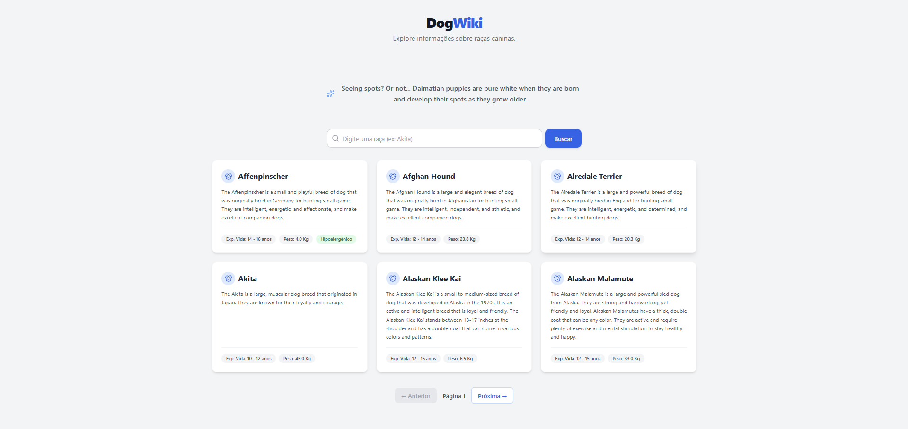
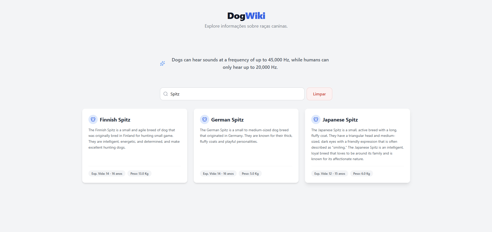

# 🐶 DogWiki
Uma Single Page Application (SPA) responsiva para explorar raças de cães, desenvolvida com React.


## 🔗 Demonstração Online
👉 **[Acesse o projeto rodando aqui]()**

## ✨ Funcionalidades Principais

* **Listagem Paginada** 
* **Busca Interativa** 
* **Design Responsivo (Mobile-First)** 
* **Arquitetura de Componentes** 





## 🛠️ Tecnologias Utilizadas

* **React (Vite):** Utilização de Hooks (`useState`, `useEffect`) e Custom Logic.
* **Tailwind CSS:** Estilização utilitária para desenvolvimento ágil.
* **Axios:** Cliente HTTP para consumo de API REST.
* **Lucide React:** Biblioteca de ícones.

## 🚀 Como Rodar Localmente

Clone o repositório:

```bash
git clone [https://github.com/Tiegow/Dog-Wiki.git](https://github.com/Tiegow/Dog-Wiki.git)
```
Entre na pasta:

```bash
cd dog-wiki
```
Instale as dependências:


```bash
npm install
```
Rode o servidor de desenvolvimento:

```bash
npm run dev
```